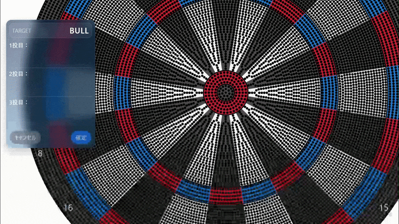
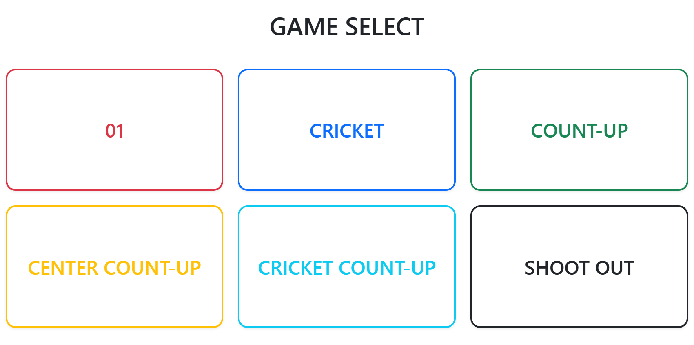
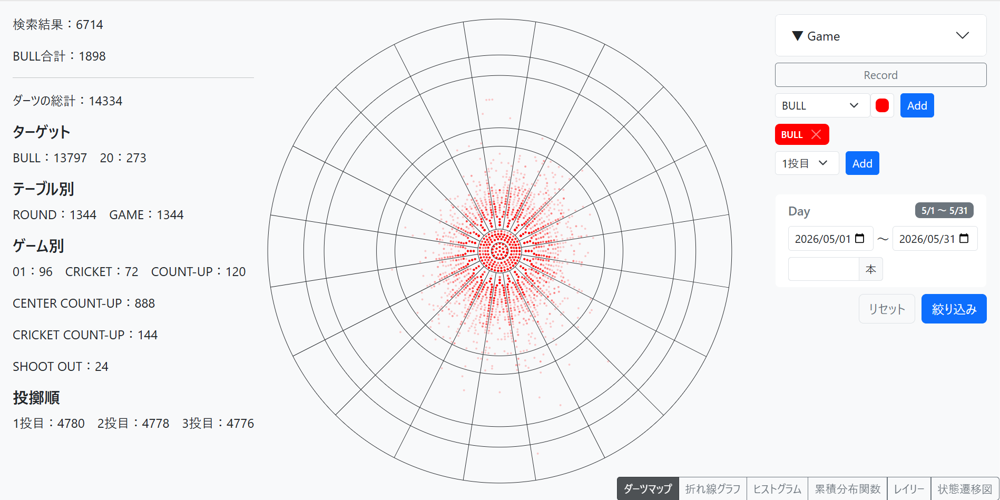
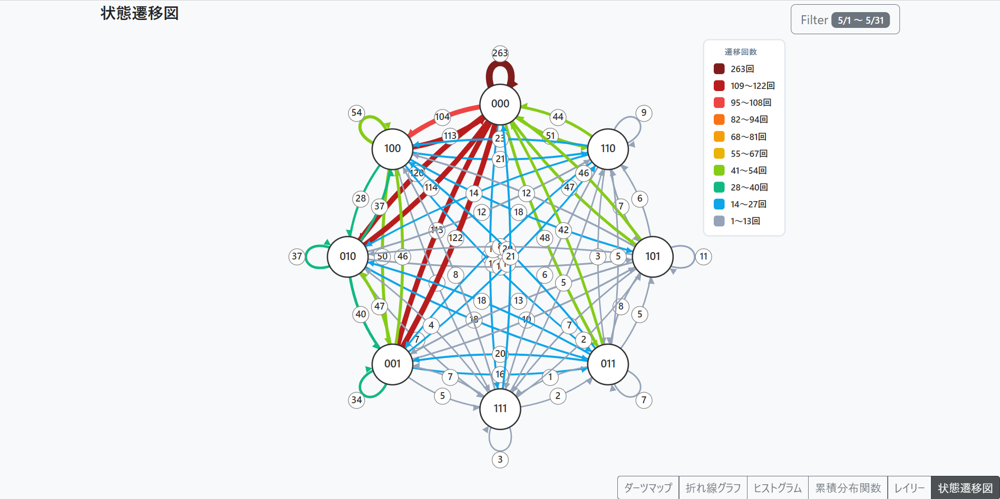
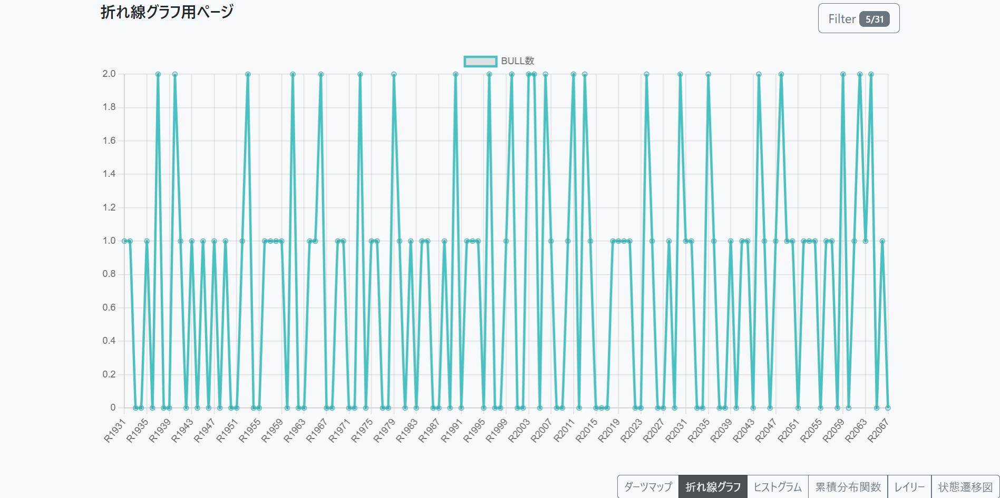
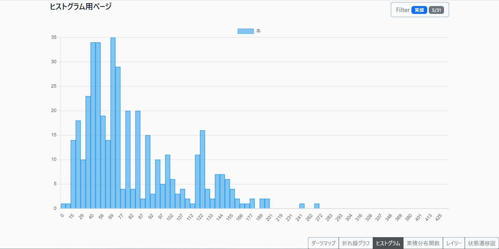

## 概要
Darts-Log は、ソフトダーツ（主にDARTSLIVE3の仕様を想定）のプレイデータを記録・分析するためのRuby on Rails製ウェブアプリケーションです。
毎ラウンドのダーツの投擲結果を詳細に記録し、ハットトリックやTon80といったアワードを自動的に判定・集計することができます。

## 開発の背景
自宅にダーツボード（DARTSLIVE-ZERO BOARD）を設置し、日頃から練習を行っています。練習を重ねる中で、「どこを狙い、実際にはどこへ刺さったのか」といった投擲データを記録・分析したいと考えるようになりました。

しかし、DARTSLIVE-ZERO BOARDは電子ダーツボードではないため、投擲結果を自動で記録する機能はありません。

そこで、ボード上の刺さった位置をアプリ上で入力し、投擲データを蓄積・分析できるWebアプリケーションを開発しました。投擲位置をビット単位で記録するだけでなく、01ゲームやクリケットなどのゲームをプレイしながら記録できる機能や、アワードの自動判定や統計情報の表示、状態遷移図による投擲傾向の可視化などを実装しています。

## アプリ画面

### 測定・記録画面
ダーツボード上の着弾位置をタップすることで、各投擲の正確な座標データ（r, θ）とスコアをリアルタイムに記録します。
<br>


### ゲーム選択
01（ゼロワン）やCRICKET（クリケット）をはじめ、COUNT-UP、CENTER COUNT-UP、CRICKET COUNT-UP、SHOOT OUTの6つの主要なゲームデータを記録できます。
<br>


### データ分析
蓄積したプレイデータをさまざまな角度から統計的に分析し、自身の投擲傾向や成績の推移を視覚的に確認できます。

<table>
  <tr>
    <td width="50%" valign="top">
      <h4>弾道分布（ダーツマップ）</h4>
      ダーツの着弾位置をボード上にマッピングし、グルーピングの精度や狙いに対するばらつきを視覚的に確認できます。<br><br>
      
    </td>
    <td width="50%" valign="top">
      <h4>状態遷移図</h4>
      各投擲を状態として扱い、次にどの状態へ遷移したかを可視化します。BULLへの連続ヒット率など、プレイ中の傾向を分析できます。<br><br>
      
    </td>
  </tr>
  <tr>
    <td width="50%" valign="top">
      <h4>折れ線グラフ</h4>
      ラウンドごとのBULL率の推移を可視化し、調子の変化や成績のトレンドを長期的に確認できます。<br><br>
      
    </td>
    <td width="50%" valign="top">
      <h4>ヒストグラム</h4>
      スコアの分布を可視化し、実力のばらつきや頻出するスコア帯（安定度）を客観的に分析できます。<br><br>
      
    </td>
  </tr>
</table>

## 主な機能
* **プレイデータの詳細な記録**: 各ラウンドごとのスコアや刺さった位置を記録します（`record_round`、`darts` テーブルによるリレーショナルなデータ管理）。
* **アワードの自動判定ロジック**: 入力された投擲データに基づき、Hat TrickやTon80などのダーツ特有のアワードを獲得したかを自動計算します。
* **カスタムアイコン表示**: SVGスプライトを活用し、軽量かつメンテナンス性の高いカスタムアイコンをUIに実装しています。
* **効率的なデータ操作**: モデルの `enum` や `scope` を活用した、直感的で効率的なデータベース設計。

## 使用技術
### バックエンド
-  Ruby 3.1.2
-  Ruby on Rails 7.0.10

### フロントエンド
-  HTML
-  CSS
-  JavaScript
-  Bootstrap
-  Stimulus

### データベース
-  SQLite3

## ローカル環境でのセットアップ

以下の手順でローカル環境にアプリケーションを構築し、起動することができます。

```bash
# 1. リポジトリのクローン
git clone https://github.com/daisuke-shimura/Darts-Log.git

# 2. プロジェクトディレクトリへ移動
cd Darts-Log

# 3. 必要なパッケージ（Gemなど）のインストール
bundle install

# 4. データベースの作成とマイグレーション
rails db:migrate

# 5. ローカルサーバーの起動
rails s
